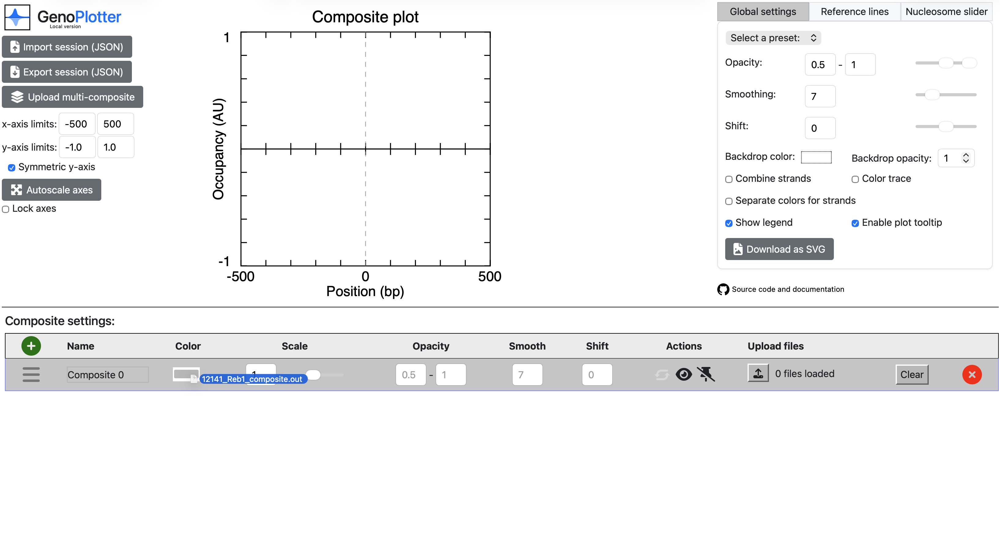
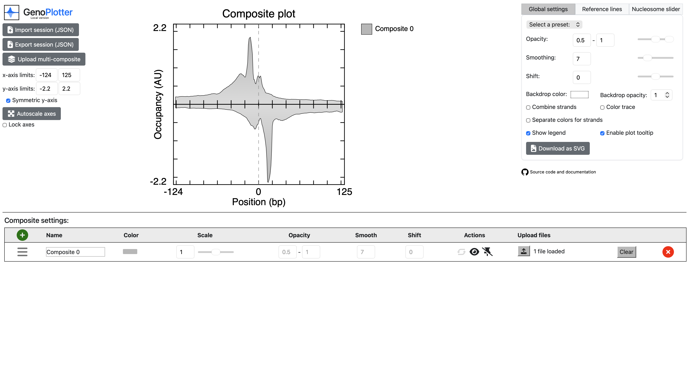
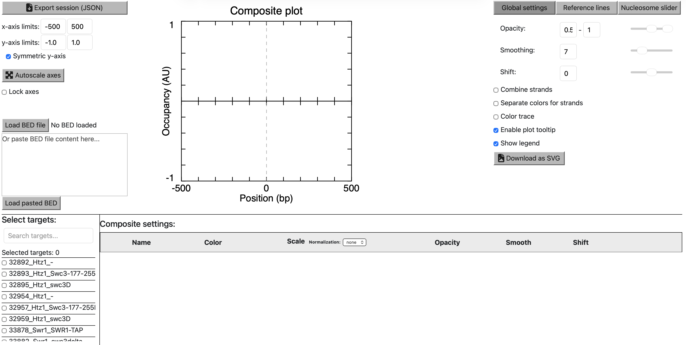
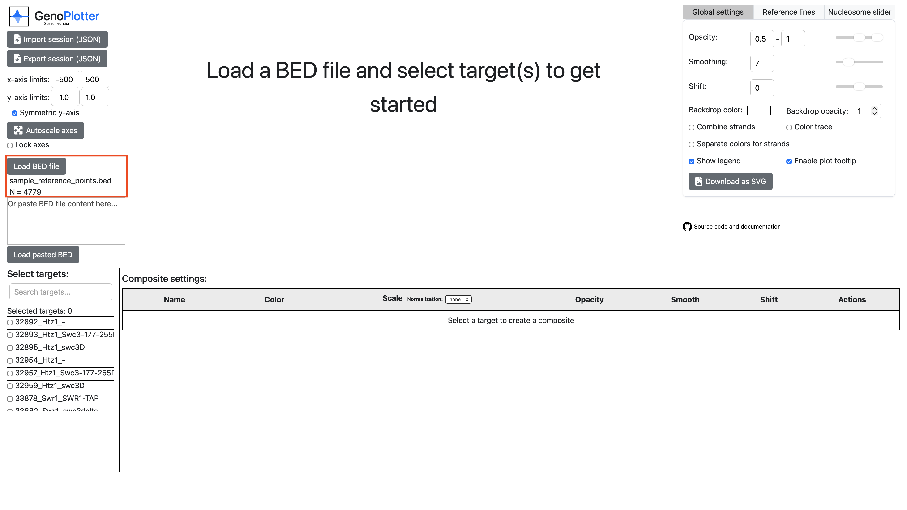
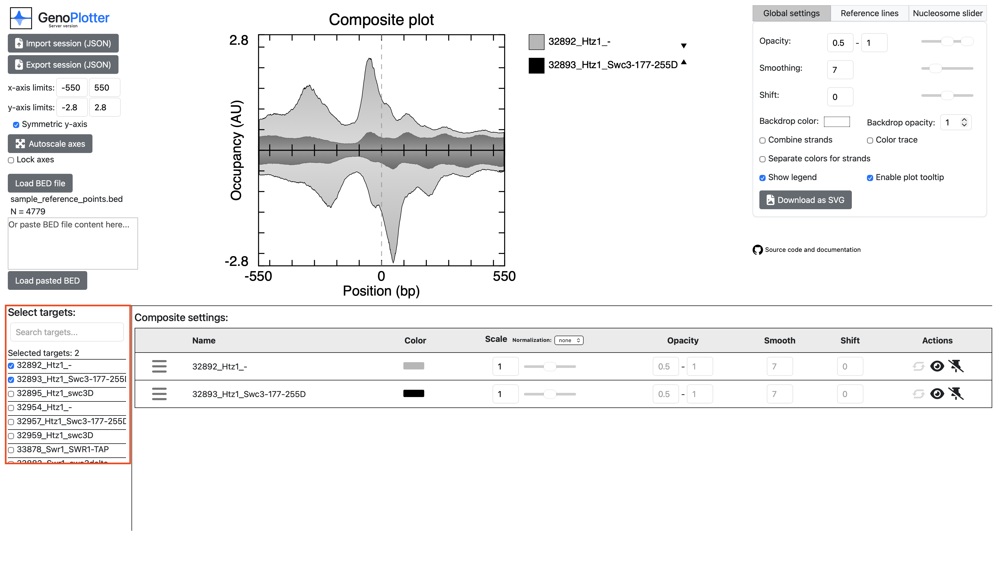

# GenoPlotter: a user-friendly browser tool for plotting quantitative data relative to genomic loci

### Justin S Cha<sup>1</sup>, Olivia WM Lang<sup>1</sup>, Benjamin O Beer<sup>2</sup>, B Franklin Pugh<sup>1</sup>, William KM Lai<sup>1,3*</sup>

<sup>1</sup>Department of Molecular Biology and Genetics, Cornell University, USA
<br>
<sup>2</sup>College of Agriculture and Life Sciences, Cornell University, USA
<br>
<sup>3</sup>Department of Computational Biology, Cornell University, USA
<br>
<sup>*</sup>Corresponding author

### Correspondence: wkl29@cornell.edu

## Abstract

Line plots of quantitative data relative to genomic loci, or composite plots, have become a crucial way to quickly convey biomolecular snapshots of specific genomic features. They have been used to represent and understand chromatin accessibility, transcription factor occupancy, DNA sequence grammar, and other aspects of gene regulation. It is important even for experimental scientists not well-versed in computation to quickly generate and manipulate such plots to maximize the clarity of their findings. We present **GenoPlotter**, an interactive browser tool that allows users to easily produce publication-ready composite plots with adjustable settings tailored for quantitative omics data. These settings include strand separation, composite scaling, and smoothing among other useful settings. GenoPlotter also allows users to save a session as a JSON configuration file that can easily be sent to other users and loaded on another instance. GenoPlotter provides a way for scientists to easily optimize the interpretability of their composite plots with broad applications to omics data.

**GenoPlotter** supports dual deployment modes:

- **Local Mode** (`local.html`): Standalone web app requiring no server - load and visualize data entirely in the browser
- **Server Mode** (`server.html`): Full-stack deployment with Node.js backend for efficient querying of large BIGWIG files

## Prerequisites

For the local version, any modern web browser will work (e.g., Chrome, Firefox, Safari, etc.). To deploy the server version, a remote server (ubuntu supported) is required to host the API and genomic BIGWIG files.

## Getting started

### Local mode (no server required)
First, clone this repository with `git clone https://github.com/CEGRcode/GenoPlotter.git`. Then simply open `local.html` using an internet browser.

### Server setup
The remote version of GenoPlotter requires a table of BIGWIG files formatted as a tab-separated table:
```
name	forward	reverse
sample1	/path/to/sample1.forward.bigwig	/path/to/sample1.reverse.bigwig
...
```
BIGWIG files can be absolute paths or http(s) URLs.

You can optionally include a table of normalization factors also formatted as a tab-separated table:
```
name	method1	method2	...
sample1	1.23	4.56	...
...
```
#### Ubuntu
On your remote server:
1. Clone this repository with `git clone https://github.com/CEGRcode/GenoPlotter.git`
2. Run setup script (make sure you have sudo privileges) `GenoPlotter/server_setup_scripts/setup-ubuntu.sh /path/to/bigwig_table.txt /path/to/normalization_factors.txt`

### Running the server
1. Open up a background shell with `tmux new -s GenoPlotter`
2. Run the server with `node GenoPlotter/js/api/server.js`

Then your GenoPlotter instance can be accessed by entering the remote server's IP address into an internet browser.

To stop the server, enter the background shell with `tmux a -t GenoPlotter` and interrupt the server with `Ctrl+C`.

## Examples

### Local mode
An example input file is provided in `sample_inputs/local/12141_Reb1_composite.out`, as generated by [Scriptmanager](https://github.com/CEGRcode/scriptmanager) according to the [ChIP-exo tutorial](https://pughlab.mbg.cornell.edu/scriptmanager-docs/docs/Guides/Tutorials/chipexo-tutorial/). To view the data in GenoPlotter simply drag the file and drop it on the first row in the table as shown below:



The result should look something like this:



### Server mode
An example set of inputs is provided in `sample_inputs/server`, from [Louder et al 2024](https://github.com/CEGRcode/2024-Louder_Cell). To set it up on a remote ubuntu server, run:
```
GenoPlotter/server_setup_scripts/setup-ubuntu.sh GenoPlotter/sample_inputs/server/sample_bigwig_table.txt GenoPlotter/sample_inputs/server/sample_normalization_factors.txt
```
Then you can visit the page by typing your remote server's IP address into your web browser. It should look like this:



To load the reference points, simply click the "Load BED file" button and select the file to upload (note that all genomic regions in the BED file must be the same width):



Then check boxes in the targets list below to view the data for the corresponding samples:

